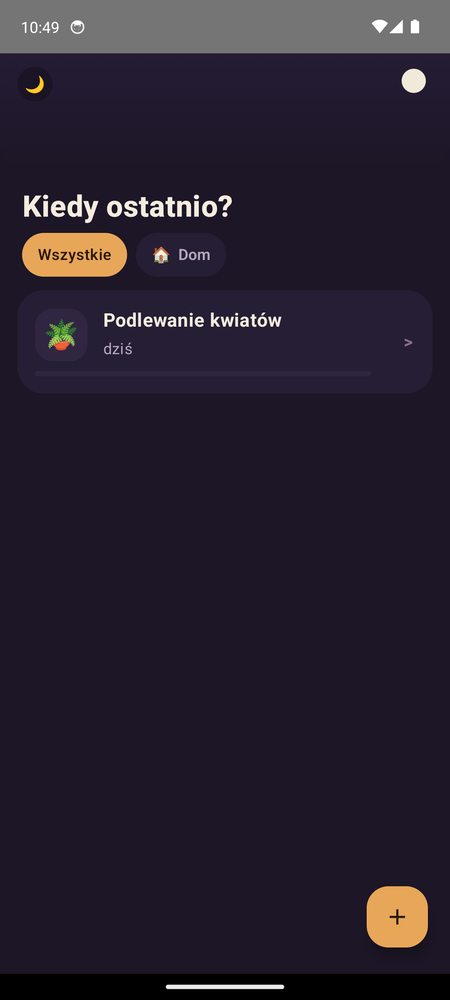
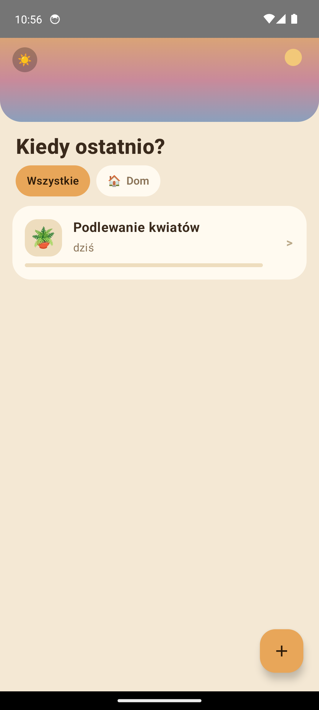
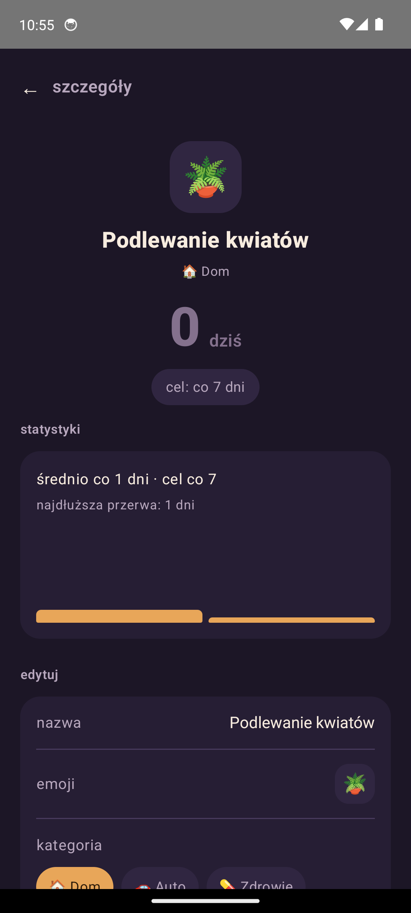
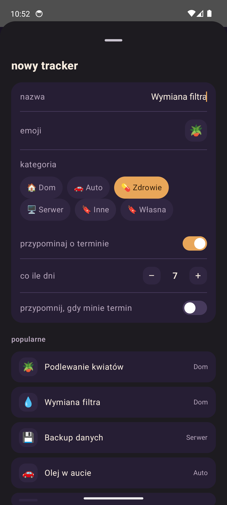

# Sincely

Sincely is a "when did I last do this" tracker — watering plants, replacing a
filter, doing a backup, anything you do on a recurring basis and easily lose
track of. The core of the app is a single tap ("check-in"), from which a
tracker's status (`OK` / `WARNING` / `OVERDUE`) is derived relative to its
expected frequency. Offline-first, no backend — everything lives locally in
SQLite on the device.

**Android is a complete, working app**: list/detail screens, adding and
editing trackers, quick check-ins and backdated check-ins with notes,
archiving/deleting, category filtering, light/dark theme, stats and
history. **iOS is not there yet** — the shared Kotlin side is fully wired
(`IosTrackerGateway` exposes everything the Android ViewModel does), but
the SwiftUI screens themselves are still a placeholder. See
[TODO](#todo--remaining-work) below, and
[`docs/CODE_GUIDE.md`](docs/CODE_GUIDE.md) for a full tour of how the code
is organized and how data flows through it.

## Screenshots

Android, light and dark theme:

<p>
  
  
  
  
</p>

## Stack

- **Kotlin Multiplatform** (Kotlin 2.3.21, K2) — all domain logic in `commonMain`
- **SQLDelight 2** — typed SQL queries, `AndroidSqliteDriver` / `NativeSqliteDriver`
- **kotlinx-datetime** + `kotlin.time.Instant` — status computation and time formatting
- **Koin** — DI wiring the database and repository together
- **kotlinx.serialization** — models ready for a future JSON export/import
- **Android**: Jetpack Compose + Material 3
- **iOS**: SwiftUI, integration with `shared` without CocoaPods (`embedAndSignAppleFrameworkForXcode`)

## Project structure

```
sincely/
├─ shared/               # Kotlin Multiplatform
│  └─ src/
│     ├─ commonMain/     # domain models, statuses, SQLDelight, repository, Koin
│     ├─ commonTest/     # unit tests for domain logic
│     ├─ androidMain/    # AndroidSqliteDriver, Koin androidContext
│     └─ iosMain/        # NativeSqliteDriver, facade for Swift (IosTrackerGateway)
├─ androidApp/           # Jetpack Compose + Material 3, single-activity
├─ iosApp/               # SwiftUI, Xcode project (no CocoaPods)
├─ gradle/libs.versions.toml
├─ build.gradle.kts, settings.gradle.kts
└─ .github/workflows/ci.yml
```

### Architectural principle

All domain logic (statuses, day counting, time formatting) lives exclusively
in `shared/commonMain`. The UI layers (Compose, SwiftUI) compute nothing —
they only render state received from the repository. Data flow is
one-directional: repository (SQLDelight, `Flow`) → ViewModel/gateway → UI.

For a detailed walkthrough of each layer — the domain model, the SQLDelight
schema, the repository, Koin wiring, every Android screen file, the current
iOS gap, and a step-by-step recipe for adding a new feature — see
[`docs/CODE_GUIDE.md`](docs/CODE_GUIDE.md).

## How to build

Requirements: JDK 17+. Building `androidApp` requires the Android SDK
(`ANDROID_HOME`/`ANDROID_SDK_ROOT` env var, or a `local.properties` file with
an `sdk.dir` path). Building `iosApp` requires macOS + Xcode.

```bash
# unit tests for domain logic (shared/commonTest)
./gradlew :shared:allTests

# Android build (debug APK)
./gradlew :androidApp:assembleDebug

# both at once
./gradlew :shared:allTests :androidApp:assembleDebug
```

### Android

Install the generated APK (`androidApp/build/outputs/apk/debug/`) or open
the project in Android Studio and run the `androidApp` configuration.

#### Running on the emulator from the command line

Requires the `sincely` AVD to already exist (created once via Android Studio's
Device Manager or `avdmanager`) and `ANDROID_HOME`/`ANDROID_SDK_ROOT` to be set.

```bash
# builds, installs, and launches the app; starts the 'sincely' emulator
# first if none is running yet (waits for it to finish booting) — this is
# the only command needed after a fresh reboot
./gradlew runOnEmulator

# only starts the 'sincely' emulator if no device/emulator is connected,
# without building/installing anything
./gradlew startEmulatorIfNeeded

# debug APK only, no install/launch (see path printed at the end)
./gradlew buildApk
```

`runOnEmulator` is idempotent: if a device/emulator is already connected via
`adb`, it skips starting a new one and just reinstalls + relaunches the app.

### iOS

`shared.framework` is built automatically on every Xcode build via a script
in the "Compile Kotlin Framework" phase
(`./gradlew :shared:embedAndSignAppleFrameworkForXcode`), so nothing needs to
be built manually from the command line beforehand:

1. Open `iosApp/iosApp.xcodeproj` in Xcode.
2. Select the `iosApp` scheme and run on the simulator.

The project deliberately does not use CocoaPods — integration with `shared`
is "direct" (Framework Search Paths + `-framework shared` in `OTHER_LDFLAGS`).

## Tests

Unit tests for the domain logic (`computeStatus`, `daysSince`,
`RelativeTimeFormatter`) live in `shared/src/commonTest` and run on the JVM
(via `:shared:allTests`, no emulator/simulator needed), since all the logic
is pure Kotlin with no platform dependencies.

## TODO — remaining work

Android is feature-complete for the current scope (see
[`docs/CODE_GUIDE.md`](docs/CODE_GUIDE.md) for the full list of what's
implemented). What's left:

- **iOS screens** — `IosTrackerGateway` already exposes everything the
  Android ViewModel does (`getTrackerCards`, `getDetail`, `addTracker`,
  `quickCheckIn`, `checkInWithOptions`, `archiveTracker`, `deleteTracker`,
  `undoLastCheckIn`, ...) as ready-to-render DTOs. The SwiftUI side does
  not use any of it yet: `TrackerListView.swift` still calls the old
  placeholder `gateway.getTrackers()` / `gateway.addSampleTracker()`, which
  no longer exist on the gateway — this file most likely does not compile
  against the current `shared` framework. Needed: list/detail/add/check-in
  SwiftUI screens mirroring the Android ones, plus a matching color palette
  (`SincelyColors.swift`) and an expanded `IosStrings.swift`.
- **i18n** — `RelativeTimeStrings` and the UI strings (`AndroidStrings`,
  `IosStrings`) are hardcoded in Polish, but deliberately factored into
  constants so wiring up resources/`Localizable.strings` will be mechanical.
- **Real reminder notifications** — reminders currently only have a
  toggle + an in-UI preview of what the notification would say; nothing is
  scheduled via WorkManager/`UNUserNotificationCenter` yet.
- **JSON export/import** — the models already have `@Serializable`, but no
  code actually serializes/writes/reads a file yet.
- **SQLDelight migrations** — the schema is at version 1, no migration
  mechanism/test yet (nothing to migrate from yet).
- **App icon** — the `AppIcon.appiconset` (iOS) and adaptive icon (Android)
  are currently a simple vector placeholder, not the final branding.
- **CI for iOS** — the workflow only builds and tests `shared` +
  `androidApp`; the Xcode build requires a macOS runner and isn't wired up
  yet.
